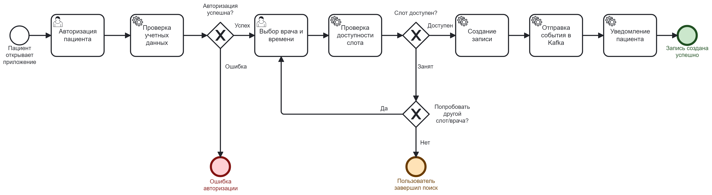

# Обзор архитектуры системы

В этом разделе описана архитектура системы — ключевые компоненты, модули и модели данных.

## Архитектурные компоненты и данные

- [modules.md](./modules.md) — описание основных модулей системы
- [entities.md](./entities.md) — описание сущностей и моделей данных
- [containers.md](./containers.md) — контейнеры и интеграционные слои

## Пример типового процесса

В данной папке для иллюстрации типовых процессов подготовлен отдельный пример:

- [patient_appointment_booking.bpmn](./diagrams/patient_appointment_booking.bpmn) — BPMN диаграмма
- 
- Подробности в последовательностных диаграммах:
  - [Авторизация пациента](./diagrams/patient-authentication-detailed.puml)
  - [Бронирование записи](./diagrams/appointment-booking-detailed.puml)

---

Используйте данный файл как основную точку входа при изучении архитектуры.

